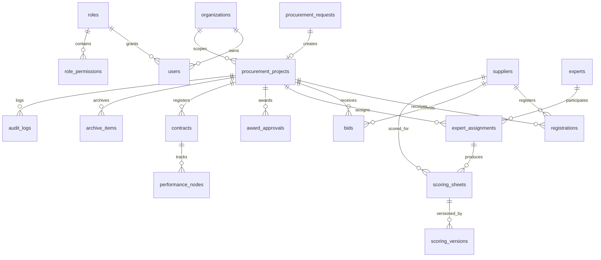
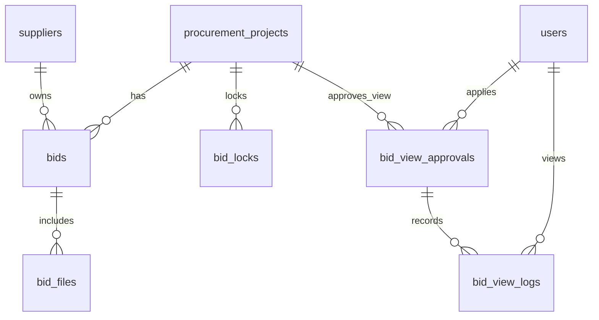
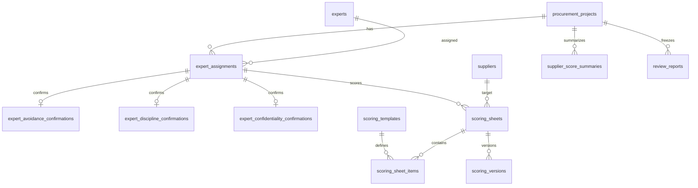

# 国企酒店集团阳光采购与专家评审管理平台正式 MVP 开发启动设计文档

版本：V0.1 设计冻结草案  
日期：2026-06-23  
适用阶段：第一批输出，设计冻结与工程启动准备  
当前结论：可以进入正式 MVP 开发准备，但不得直接进入大规模业务代码开发。

## 1. 文档目标

本文基于客户评审版 Demo 与配套文档，反向沉淀正式 MVP 系统设计，作为后续工程骨架初始化、P0 模型落地、Mock API、权限中间件、审计中间件和基础测试框架的唯一启动输入。

本批输出只做设计冻结，不修改 Demo，不初始化正式工程，不实现完整业务模块。

已吸收交付物：

| 交付物 | 吸收结论 |
|---|---|
| `demo/index.html` | 当前 Demo 是静态单页壳，包含角色切换、导航、内容区和弹窗入口。 |
| `demo/app.js` | 已体现页面分区、角色菜单、供应商隔离、专家隔离、报价保密、异常查看、外部交易阻断、管理员边界等关键演示逻辑。 |
| `demo/mock-data.js` | 已包含正式建模所需的核心实体原型和 4 类场景项目。 |
| `docs/product-information-architecture.md` | 明确产品定位、一级菜单、角色入口、项目拆分和第二轮修正口径。 |
| `docs/page-list.md` | 明确页面、字段、按钮、状态控制、权限控制和审计留痕点。 |
| `docs/role-permissions.md` | 明确 6 类角色、菜单权限、数据范围和敏感数据不可见边界。 |
| `docs/customer-review-guide.md` | 明确客户评审顺序、20 项验收点和待客户确认事项。 |
| `docs/core-flows.md` | 明确内部采购、报价保密、异常查看、专家评审、定标、外部备案、合同履约、档案审计流程。 |
| `docs/demo-structure-and-mock-data.md` | 明确 Demo 页面结构、Mock 数据结构和数据权限实现说明。 |
| `docs/erd-interface-schedule.md` | 提供 ERD、接口边界和排期建议基础。 |
| `output/review-package-manifest.md` | 已确认交付包清单与当前工作区 Demo/docs 一致。 |

### 1.1 第一批输出覆盖关系

| 目标要求 | 本文覆盖位置 |
|---|---|
| 正式开发总体方案 | 第 2、3、5、17、18 节 |
| 工程目录结构 | 第 4 节 |
| 技术栈建议 | 第 3 节 |
| 数据模型设计 | 第 6 节 |
| ERD 草案 | 第 7 节 |
| 数据字典草案 | 第 8 节 |
| 状态机设计 | 第 9 节 |
| 权限模型设计 | 第 10 节 |
| API 契约草案 | 第 11 节 |
| Mock / Seed 数据方案 | 第 12 节 |
| 第一阶段开发任务拆分 | 第 13 节 |
| 测试策略 | 第 14 节 |
| 风险清单 | 第 15 节 |
| 客户待确认但不阻断工程骨架开发事项 | 第 16 节 |

## 2. 项目定位与一期边界

### 2.1 项目定位

本项目定位为：国企酒店集团内部自用的阳光采购与专家评审管理平台。

一期重点建设：

| 方向 | 一期建设内容 |
|---|---|
| 内部阳光采购 | 采购需求、采购方式建议、项目立项、采购文件、公告 / 邀请、报名、报价、报价截止锁定。 |
| 供应商协同 | 供应商准入、品类授权、资质、限制名单、报名、报价、合同履约、评价反馈。 |
| 报价保密 | 截止前报价金额和响应文件默认不可见，异常查看需审批、限范围、限时间、写日志。 |
| 专家评审 | 专家抽取 / 指定 / 替换、回避确认、纪律确认、保密承诺、独立评分、重评版本。 |
| 定标审批 | 评分汇总、评审报告、非最低价中选理由、定标审批、结果通知留痕。 |
| 外部交易备案 | 外部交易项目备案、外部公告资料、外部结果资料、合同台账、履约评价、档案和审计。 |
| 合同履约台账 | 采购侧合同编号、状态、合同系统链接、履约节点、验收付款记录。 |
| 档案与审计 | 档案目录快照、完整性检查、封存、补档申请、审计日志和监督查询。 |

### 2.2 明确非范围

一期不建设、不承诺、不在工程中隐性实现以下能力：

| 非范围事项 | 控制口径 |
|---|---|
| 完整法规级电子招投标交易平台 | 本平台只做集团内部采购治理与专家评审管理。 |
| 公共资源交易平台 | 不承接公共资源交易平台业务、流程、法规能力。 |
| 政府采购交易平台 | 不承接政府采购平台规则和交易能力。 |
| CA 认证、电子签章 | 一期禁止纳入功能、验收和工程实现。 |
| 投标文件加密、开标解密 | 一期不做投标文件加密解密能力。 |
| 可信时间戳、防篡改存证 | 一期不做上线级存证能力承诺。 |
| 开标大厅、唱标、解密仪式 | 一期不做完整交易平台仪式化流程。 |
| 替代 ERP、OA、财务、合同、主数据系统 | 本平台只做采购侧流程和台账，不替代既有系统。 |
| 真实外部系统联调闭环 | 第一阶段只定义 Adapter / Mock / Stub，不做真实联调。 |
| 将 Odoo 写死为唯一技术路线 | Odoo 只能作为可选方案或集成对象，不能成为唯一路线。 |
| 写死金额阈值、审批链、采购方式、评分模板、档案目录 | 未经客户最终确认的规则必须配置化。 |

### 2.3 三段式推进顺序

| 阶段 | 目标 | 允许输出 | 明确禁止 |
|---|---|---|---|
| 第一批：设计冻结 | 把 Demo 和 docs 沉淀为正式设计输入 | 总体方案、工程目录、技术栈建议、数据模型、ERD、数据字典、状态机、权限模型、API 草案、Mock/Seed、任务拆分、测试策略、风险和待确认清单 | 初始化工程、写业务代码、建真实数据库、真实联调 |
| 第二批：工程骨架 | 搭建可运行骨架和 P0 基础能力 | 工程骨架、核心模型、Mock API、权限中间件、审计中间件、Seed 数据、P0 测试框架 | 完整业务模块开发、真实外部系统联调、生产级安全承诺 |
| 第三批：模块开发 | 在 P0 骨架验证后开发 MVP 主流程 | 供应商、采购、报价、专家评审、定标、合同、档案、审计等模块 | 越过客户未确认规则直接固化实现 |

## 3. 技术栈建议

当前仓库是静态 Demo，没有正式后端和数据库技术栈。因此正式 MVP 可在客户技术约束确认前采用“推荐路线 + 可替代路线”的方式，不写死唯一技术路线。

### 3.1 推荐路线：企业常规前后端分层单体

| 层级 | 建议技术 | 理由 |
|---|---|---|
| 前端 | Vue 3 + TypeScript + Vite + Pinia + Vue Router | 适合国内企业后台团队交付，页面模块清晰，便于从静态 Demo 迁移。 |
| 后端 | Java 21 + Spring Boot 3 + Spring Security | 企业系统常见，权限、审计、事务、定时任务、外部 Adapter 支持成熟。 |
| 数据库 | PostgreSQL 16 或客户指定国产兼容数据库 | 支持关系建模、JSON 快照、事务和审计查询。若客户要求国产数据库，需做兼容评估。 |
| ORM / 迁移 | MyBatis Plus 或 JPA + Flyway | 便于数据库结构版本化，避免手工改表。 |
| API 契约 | OpenAPI 3.1 | 前后端、Mock、测试、客户接口评审都可复用。 |
| 文件服务 | File Service Adapter | 一期只定义文件元数据、权限校验、上传下载契约，可接客户文件服务。 |
| Mock / Seed | SQL seed + JSON scenario seed | 复用 Demo 场景数据，支持本地演示和测试。 |
| 测试 | JUnit、Testcontainers、Vitest、Playwright | 覆盖领域规则、API 权限、页面主流程和端到端验证。 |

该路线适合客户内部 IT 团队偏 Java / Vue、需要长期维护和审计可控的场景。

### 3.2 可替代路线：TypeScript 全栈分层单体

| 层级 | 建议技术 | 适用场景 |
|---|---|---|
| 前端 | React 或 Vue + TypeScript + Vite | 团队已有前端 TypeScript 能力。 |
| 后端 | NestJS 或 Fastify + TypeScript | 团队希望快速把 Demo 的数据结构迁移为 Mock API。 |
| 数据层 | Prisma + PostgreSQL | 类型一致性强，适合快速建模。 |

该路线迁移 Demo 数据较快，但需确认客户长期运维团队是否接受 Node.js 后端。

### 3.3 不推荐作为一期唯一路线

| 路线 | 不推荐原因 |
|---|---|
| 重微服务拆分 | 一期关键是规则冻结、权限、状态机和审计，过早拆分会增加联调和运维复杂度。 |
| 低代码 / Odoo 唯一路线 | 项目明确禁止将 Odoo 写死为唯一技术路线；可做评估或集成，不作为冻结结论。 |
| 直接在静态 Demo 上继续堆业务 | Demo 只用于评审，不能承载正式权限、审计、数据隔离和后端强校验。 |

## 4. 正式工程目录结构

建议采用前后端分层单体仓库，保留 Demo 作为评审资产，正式工程独立放置。

```text
apps/
  web/
    src/
      pages/
        dashboard/
        my-tasks/
        procurement/
        suppliers/
        bid-secrecy/
        expert-review/
        award/
        external-trade/
        contracts/
        archives/
        admin/
      components/
      router/
      stores/
      api/
      permissions/
  api/
    src/
      main/
        java/
          platform/
            identity/
            organization/
            supplier/
            procurement/
            bid/
            expertreview/
            award/
            externaltrade/
            contract/
            archive/
            audit/
            integration/
            config/
            common/
        resources/
          application.yml
          db/
            migration/
            seed/
docs/
  formal-mvp-development-startup-design.md
  openapi/
  erd/
  data-dictionary/
  state-machines/
  permissions/
infra/
  docker/
  db/
  scripts/
mock/
  seed/
    base/
    scenarios/
  adapters/
tests/
  api/
  domain/
  e2e/
  permission/
  fixtures/
demo/
  index.html
  app.js
  mock-data.js
  styles.css
```

### 4.1 启动命令草案

第二批工程骨架初始化后建议形成以下命令：

| 命令 | 用途 |
|---|---|
| `npm install` | 安装前端依赖。 |
| `npm run dev:web` | 启动前端开发服务。 |
| `./gradlew bootRun` 或 `mvn spring-boot:run` | 启动后端 API 服务。 |
| `npm run openapi:validate` | 校验 OpenAPI 契约。 |
| `npm run test:web` | 前端单元测试。 |
| `./gradlew test` 或 `mvn test` | 后端单元测试和领域规则测试。 |
| `npm run test:e2e` | 端到端权限和流程测试。 |

### 4.2 环境变量草案

| 变量 | 用途 | 第一阶段默认 |
|---|---|---|
| `APP_ENV` | 运行环境 | `local` |
| `APP_MOCK_MODE` | 是否启用 Mock Adapter | `true` |
| `DATABASE_URL` | 数据库连接 | 本地开发库 |
| `JWT_SECRET` | 本地 Mock 登录令牌密钥 | 本地随机值，不提交真实密钥 |
| `FILE_SERVICE_MODE` | 文件服务模式 | `mock` |
| `SSO_ADAPTER_MODE` | SSO 模式 | `mock` |
| `OA_ADAPTER_MODE` | OA 模式 | `mock` |
| `ERP_ADAPTER_MODE` | ERP 模式 | `stub` |
| `CONTRACT_ADAPTER_MODE` | 合同系统模式 | `stub` |
| `AUDIT_EXPORT_MODE` | 审计日志输出模式 | `local` |

## 5. 领域模块划分

| 领域模块 | 职责 | 第二批优先级 |
|---|---|---|
| Identity | 用户、角色、登录态、角色切换 Mock、当前用户上下文 | P0 |
| Organization | 组织树、组织范围、数据范围授权 | P0 |
| Permission | RBAC、数据范围、场景策略、按钮权限 | P0 |
| Supplier | 供应商档案、准入、品类授权、资质、限制名单、评价 | P1 |
| Procurement Request | 采购需求、采购方式建议、外部交易判定输入 | P1 |
| Project | 采购项目、项目状态机、内部 / 外部交易分支 | P0 |
| Document | 采购文件、版本、发布锁定 | P1 |
| Announcement & Registration | 公告 / 邀请、报名、资格校验 | P1 |
| Bid | 报价、响应文件、截止锁定、报价保密、异常查看 | P0 |
| Expert Review | 专家库、专家分配、三项确认、评分、重评版本、汇总 | P0 |
| Award | 定标审批、非最低价理由、结果通知 | P1 |
| External Trade | 外部交易备案、内部流程强阻断、外部资料归集 | P0 |
| Contract Performance | 合同台账、履约节点、验收付款、履约异常 | P1 |
| Archive | 档案模板、项目目录快照、完整性检查、封存、补档 | P0 |
| Audit | 审计日志、报价查看日志、敏感动作留痕 | P0 |
| Integration | SSO、OA、ERP、合同、财务、文件、消息、审计输出 Adapter | P2 |
| Dictionary Config | 金额阈值、采购方式规则、评分模板、档案目录、审批规则配置 | P0 |

## 6. 数据模型设计

### 6.1 主题域划分

| 主题域 | 核心实体 | 建模目的 |
|---|---|---|
| 身份与权限域 | `users`、`organizations`、`roles`、`role_permissions`、`system_dictionaries` | 支撑登录态、角色、菜单、按钮和数据范围。 |
| 供应商治理域 | `suppliers`、`supplier_qualifications`、`supplier_category_authorizations`、`supplier_restrictions`、`supplier_evaluations` | 支撑供应商准入、资质、品类授权、限制和评价。 |
| 采购项目域 | `procurement_requests`、`procurement_method_rules`、`procurement_projects`、`procurement_project_packages` | 支撑需求、方式判断、项目创建、内部 / 外部分支。 |
| 文件与报价域 | `procurement_documents`、`procurement_document_versions`、`announcements`、`invitations`、`registrations`、`bids`、`bid_files`、`bid_locks`、`bid_view_approvals`、`bid_view_logs` | 支撑采购文件、公告报名、报价保密和异常查看。 |
| 专家评审与定标域 | `experts`、`expert_categories`、`expert_assignments`、`expert_avoidance_confirmations`、`expert_discipline_confirmations`、`expert_confidentiality_confirmations`、`scoring_templates`、`scoring_sheets`、`scoring_sheet_items`、`scoring_versions`、`supplier_score_summaries`、`review_reports`、`award_approvals`、`result_notices` | 支撑专家产生、独立评分、版本化、汇总、报告和定标。 |
| 履约档案审计域 | `external_trade_records`、`contracts`、`performance_nodes`、`acceptance_payment_records`、`archive_templates`、`archive_items`、`archive_seal_records`、`archive_supplement_requests`、`audit_logs`、`integration_jobs` | 支撑外部备案、合同履约、档案封存补档、审计和 Adapter 作业。 |

### 6.2 全局字段规范

所有核心业务表建议统一包含：

| 字段 | 用途 |
|---|---|
| `id` | 主键。 |
| `org_id` | 组织隔离和数据范围控制。 |
| `status` | 状态机状态或业务状态。 |
| `created_by` | 创建人。 |
| `created_at` | 创建时间。 |
| `updated_by` | 更新人。 |
| `updated_at` | 更新时间。 |
| `deleted_at` | 软删除时间。 |

高风险表必须按需包含：

| 字段 | 适用对象 | 用途 |
|---|---|---|
| `supplier_id` | 供应商、报名、报价、合同、评价 | 供应商数据隔离。 |
| `expert_id` | 专家、专家分配、评分 | 专家数据隔离。 |
| `project_id` | 项目相关表 | 业务主线关联。 |
| `external_trade_flag` | 采购需求、项目 | 外部交易分支和内部流程强阻断。 |
| `before_deadline` | 项目、报价权限判断 | 截止前报价保密策略。 |
| `quote_deadline_at` | 项目、公告、报价锁定 | 报价截止判断。 |
| `locked_at` | 报价、采购文件、评分、报告、档案 | 锁定后不可改。 |
| `version_no` | 文件版本、评分版本、报告快照 | 版本追溯。 |
| `approval_status` | 审批类实体 | 审批状态。 |
| `audit_log_id` | 敏感动作实体 | 审计日志关联。 |

## 7. ERD 草案

### 7.1 核心关系总图



### 7.2 报价保密与异常查看关系



控制点：

| 控制点 | ERD 落点 |
|---|---|
| 截止前采购方默认不能看报价金额和文件 | `procurement_projects.quote_deadline_at`、`bid_locks.locked_at`、权限策略共同判断。 |
| 异常查看必须限对象、内容、时间、下载 | `bid_view_approvals.target_supplier_id`、`view_content`、`valid_from`、`valid_until`、`allow_download`。 |
| 查看和拦截都写日志 | `bid_view_logs.result`、`out_of_scope_reason`、`audit_log_id`。 |

### 7.3 专家评分版本关系



控制点：

| 控制点 | ERD 落点 |
|---|---|
| 专家评分按“专家 × 供应商”建模 | `scoring_sheets.project_id + expert_id + supplier_id + version_no`。 |
| 重评生成新版本 | `scoring_versions` 记录重评原因、审批单、快照和版本号。 |
| 经办人不得修改评分 | API 不提供修改专家评分接口，权限策略拒绝非专家本人提交前修改。 |
| 专家之间互不可见 | 专家端查询按登录态 `expert_id` 服务端过滤。 |

## 8. 数据字典草案

### 8.1 身份与权限域

| 表 | 关键字段 | 说明 |
|---|---|---|
| `organizations` | `id`、`parent_id`、`name`、`level`、`data_scope`、`status` | 集团、区域、酒店组织树。 |
| `users` | `id`、`org_id`、`role_id`、`supplier_id`、`expert_id`、`name`、`login_name`、`status` | 用户账号；供应商和专家账号通过身份字段绑定。 |
| `roles` | `id`、`role_code`、`name`、`permission_scope`、`status` | 6 类角色基础定义。 |
| `role_permissions` | `id`、`role_id`、`resource_type`、`resource_code`、`action_code`、`effect` | 菜单、页面、按钮和 API 权限。 |
| `system_dictionaries` | `id`、`dict_type`、`dict_code`、`dict_name`、`dict_value`、`status`、`effective_from`、`effective_until` | 采购方式、状态、评分模板、档案目录等配置字典。 |

### 8.2 供应商治理域

| 表 | 关键字段 | 说明 |
|---|---|---|
| `suppliers` | `id`、`org_id`、`supplier_code`、`name`、`status`、`risk_level`、`evaluation_score` | 供应商主档。 |
| `supplier_qualifications` | `id`、`supplier_id`、`qualification_type`、`file_id`、`expire_at`、`status` | 资质文件和到期提醒。 |
| `supplier_category_authorizations` | `id`、`supplier_id`、`category_id`、`valid_from`、`valid_until`、`status` | 品类授权。 |
| `supplier_restrictions` | `id`、`supplier_id`、`reason`、`effective_from`、`effective_until`、`status` | 限制名单和拦截原因。 |
| `supplier_evaluations` | `id`、`project_id`、`contract_id`、`supplier_id`、`score`、`dimensions_json`、`comment`、`risk_effect` | 履约后评价。 |

### 8.3 采购项目域

| 表 | 关键字段 | 说明 |
|---|---|---|
| `procurement_requests` | `id`、`org_id`、`title`、`category_id`、`budget_label`、`requested_by`、`method_suggestion`、`external_trade_flag`、`approval_status` | 采购需求和方式建议；金额阈值不写死。 |
| `procurement_method_rules` | `id`、`rule_code`、`rule_name`、`condition_json`、`result_method`、`status`、`version_no` | 采购方式配置规则。 |
| `procurement_projects` | `id`、`org_id`、`request_id`、`project_code`、`name`、`method_type`、`status`、`external_trade_flag`、`before_deadline`、`quote_deadline_at` | 项目主表和状态机主控。 |
| `procurement_project_packages` | `id`、`project_id`、`package_code`、`package_name`、`status` | 标段 / 包件预留；一期可按单包简化。 |

### 8.4 文件、公告、报名、报价域

| 表 | 关键字段 | 说明 |
|---|---|---|
| `procurement_documents` | `id`、`project_id`、`current_version_no`、`review_status`、`published_at`、`locked_at`、`status` | 采购文件主记录。 |
| `procurement_document_versions` | `id`、`document_id`、`version_no`、`file_id`、`change_summary`、`created_by` | 文件版本和变更留痕。 |
| `announcements` | `id`、`project_id`、`publish_scope`、`register_deadline_at`、`quote_deadline_at`、`status` | 公告发布。 |
| `invitations` | `id`、`project_id`、`supplier_id`、`invitation_status`、`sent_at` | 定向邀请供应商。 |
| `registrations` | `id`、`project_id`、`supplier_id`、`admission_status`、`category_auth_status`、`restricted_check`、`registered_at`、`status` | 报名和资格校验。 |
| `bids` | `id`、`project_id`、`supplier_id`、`amount`、`status`、`submitted_at`、`withdrawn_at`、`locked_at`、`version_no` | 报价主表；供应商只能看本企业。 |
| `bid_files` | `id`、`bid_id`、`file_id`、`file_name`、`file_hash`、`file_size`、`status` | 响应文件元数据；不做加密解密。 |
| `bid_locks` | `id`、`project_id`、`quote_deadline_at`、`locked_at`、`locked_by`、`lock_result`、`audit_log_id` | 报价截止锁定记录。 |
| `bid_view_approvals` | `id`、`project_id`、`applicant_id`、`target_supplier_id`、`view_content`、`allow_download`、`valid_from`、`valid_until`、`approval_status` | 异常查看审批单。 |
| `bid_view_logs` | `id`、`approval_id`、`actor_id`、`project_id`、`supplier_id`、`content`、`download_flag`、`result`、`out_of_scope_reason`、`created_at` | 异常查看、下载和拦截日志。 |

### 8.5 专家评审与定标域

| 表 | 关键字段 | 说明 |
|---|---|---|
| `experts` | `id`、`expert_code`、`name`、`status`、`conflict_rule_json` | 专家主档。 |
| `expert_categories` | `id`、`expert_id`、`category_id`、`status` | 专家专业分类。 |
| `expert_assignments` | `id`、`project_id`、`expert_id`、`method`、`assign_reason`、`replace_reason`、`status` | 专家抽取、指定、替换。 |
| `expert_avoidance_confirmations` | `id`、`assignment_id`、`confirmed_result`、`confirmed_at`、`audit_log_id` | 回避确认。 |
| `expert_discipline_confirmations` | `id`、`assignment_id`、`statement_version`、`confirmed_at`、`audit_log_id` | 纪律确认。 |
| `expert_confidentiality_confirmations` | `id`、`assignment_id`、`statement_version`、`confirmed_at`、`audit_log_id` | 保密承诺。 |
| `scoring_templates` | `id`、`template_code`、`template_name`、`version_no`、`status`、`config_json` | 评分模板配置，不写死。 |
| `scoring_sheets` | `id`、`project_id`、`expert_id`、`supplier_id`、`template_id`、`version_no`、`status`、`submitted_at`、`locked_at` | 专家 × 供应商评分主表。 |
| `scoring_sheet_items` | `id`、`sheet_id`、`item_code`、`item_name`、`score`、`weight`、`comment` | 评分明细项。 |
| `scoring_versions` | `id`、`sheet_id`、`version_no`、`reason`、`approval_status`、`snapshot_json`、`created_at` | 评分版本和重评留痕。 |
| `supplier_score_summaries` | `id`、`project_id`、`supplier_id`、`expert_count`、`total_score`、`rank_no`、`recommended_flag`、`anomaly_note` | 按供应商汇总评分。 |
| `review_reports` | `id`、`project_id`、`snapshot_json`、`report_status`、`frozen_at`、`locked_at` | 评审报告快照。 |
| `award_approvals` | `id`、`project_id`、`winner_supplier_id`、`non_lowest_flag`、`non_lowest_reason`、`approval_status`、`submitted_at` | 定标审批。 |
| `result_notices` | `id`、`project_id`、`supplier_id`、`notice_type`、`sent_at`、`send_result`、`audit_log_id` | 结果通知留痕。 |

### 8.6 履约、档案、审计和集成域

| 表 | 关键字段 | 说明 |
|---|---|---|
| `external_trade_records` | `id`、`project_id`、`platform_name`、`external_project_code`、`announcement_file_id`、`result_file_id`、`record_status`、`audit_log_id` | 外部交易备案；不生成内部报价和评审数据。 |
| `contracts` | `id`、`project_id`、`supplier_id`、`contract_code`、`amount`、`contract_system_url`、`status` | 合同台账；不编辑合同正文。 |
| `performance_nodes` | `id`、`contract_id`、`node_name`、`due_date`、`acceptance_status`、`payment_status`、`exception_flag` | 履约节点。 |
| `acceptance_payment_records` | `id`、`performance_node_id`、`acceptance_result`、`payment_amount`、`payment_status`、`recorded_at` | 验收付款记录。 |
| `archive_templates` | `id`、`template_code`、`template_name`、`version_no`、`status`、`template_json` | 档案目录模板。 |
| `archive_items` | `id`、`project_id`、`template_item_id`、`item_name`、`required_flag`、`collected_flag`、`source_type`、`snapshot_json` | 项目档案目录快照和完整性。 |
| `archive_seal_records` | `id`、`project_id`、`completeness`、`sealed_at`、`sealed_by`、`allow_supplement`、`supplement_requires_approval` | 档案封存记录。 |
| `archive_supplement_requests` | `id`、`project_id`、`archive_item_id`、`reason`、`approval_status`、`approved_by`、`audit_log_id` | 补档申请。 |
| `audit_logs` | `id`、`actor_id`、`role_id`、`org_id`、`project_id`、`action`、`object_type`、`object_id`、`result`、`ip`、`created_at` | 统一审计日志。 |
| `integration_jobs` | `id`、`adapter_type`、`job_type`、`request_payload`、`response_payload`、`status`、`started_at`、`finished_at` | 外部 Adapter 作业记录。 |

## 9. 核心状态机设计

### 9.1 内部采购项目状态机

| 顺序 | 状态 | 说明 |
|---|---|---|
| 1 | `draft` | 草稿。 |
| 2 | `request_submitted` | 采购需求已提交。 |
| 3 | `method_decided` | 采购方式已判断。 |
| 4 | `project_created` | 项目已创建。 |
| 5 | `document_preparing` | 采购文件编制中。 |
| 6 | `document_published` | 采购文件已发布并锁定。 |
| 7 | `registration_open` | 报名开放。 |
| 8 | `bidding_open` | 报价开放。 |
| 9 | `bidding_locked` | 报价截止并锁定。 |
| 10 | `expert_reviewing` | 专家评审中。 |
| 11 | `review_report_frozen` | 评审报告冻结。 |
| 12 | `award_approving` | 定标审批中。 |
| 13 | `result_notified` | 结果已通知。 |
| 14 | `contract_registered` | 合同台账已登记。 |
| 15 | `performing` | 履约中。 |
| 16 | `evaluated` | 已完成供应商评价。 |
| 17 | `archived` | 已归档。 |
| 18 | `closed` | 已关闭。 |
| - | `cancelled` | 已取消。 |

主要控制规则：

| 规则 | 控制点 |
|---|---|
| 报价截止前不得进入报价汇总、专家评审、定标 | 状态必须先到 `bidding_locked`。 |
| 采购文件发布后不可直接修改 | `procurement_documents.locked_at` 非空后只能生成新版本。 |
| 评审报告冻结后不可修改实质结论 | `review_reports.locked_at` 非空后只允许补充非实质说明。 |
| 非最低价中选必须填写理由 | `award_approvals.non_lowest_flag = true` 时 `non_lowest_reason` 必填。 |

### 9.2 外部交易项目状态机

| 顺序 | 状态 | 说明 |
|---|---|---|
| 1 | `external_draft` | 外部交易备案草稿。 |
| 2 | `internal_approval_recorded` | 内部立项 / 审批留痕已记录。 |
| 3 | `external_project_recorded` | 外部平台项目编号已登记。 |
| 4 | `external_announcement_uploaded` | 外部公告资料已上传。 |
| 5 | `external_result_uploaded` | 外部中标结果资料已上传。 |
| 6 | `external_result_recorded` | 外部结果备案完成。 |
| 7 | `external_contract_registered` | 合同台账已登记。 |
| 8 | `external_performing` | 履约中。 |
| 9 | `external_evaluated` | 已完成供应商评价。 |
| 10 | `external_archived` | 已归档。 |
| 11 | `external_closed` | 已关闭。 |

强阻断动作：

| 禁止动作 | 拦截规则 |
|---|---|
| `internal_announcement` | `external_trade_flag = true` 时拒绝创建内部公告。 |
| `internal_registration` | `external_trade_flag = true` 时拒绝内部报名。 |
| `internal_bid` | `external_trade_flag = true` 时拒绝内部报价。 |
| `internal_expert_review` | `external_trade_flag = true` 时拒绝内部专家评审。 |
| `internal_award` | `external_trade_flag = true` 时拒绝内部定标。 |

所有拦截必须写入 `audit_logs`。

### 9.3 报价状态机

| 状态 | 可进入条件 | 退出条件 |
|---|---|---|
| `draft` | 供应商创建报价草稿 | 提交报价。 |
| `submitted` | 截止前提交成功 | 截止前撤回或截止后锁定。 |
| `withdrawn` | 截止前供应商撤回 | 截止前重提。 |
| `resubmitted` | 截止前重提成功 | 截止后锁定。 |
| `locked` | 到达报价截止时间并执行锁定 | 归档或判定无效。 |
| `invalid` | 资格或合规校验无效 | 归档。 |
| `archived` | 项目归档 | 终态。 |

控制规则：

| 规则 | 实现要求 |
|---|---|
| 截止前供应商可撤回重提 | 服务端校验当前时间小于 `quote_deadline_at`。 |
| 截止后自动锁定 | 定时任务或状态流转写入 `bid_locks`。 |
| 锁定后不能修改 | `locked_at` 非空后拒绝编辑。 |
| 锁定后才允许按权限汇总查看 | `project.status = bidding_locked` 或后续状态才返回汇总。 |
| 截止前查看报价必须走异常查看审批 | 未命中有效 `bid_view_approvals` 时拒绝并写日志。 |

### 9.4 专家评分状态机

| 状态 | 说明 |
|---|---|
| `assigned` | 专家已分配。 |
| `avoidance_pending` | 待回避确认。 |
| `discipline_pending` | 待纪律确认。 |
| `confidentiality_pending` | 待保密承诺。 |
| `scoring` | 可评分。 |
| `saved` | 已暂存。 |
| `submitted_locked` | 已提交并锁定。 |
| `reevaluation_requested` | 重评已申请。 |
| `reevaluation_approved` | 重评已审批通过。 |
| `resubmitted_locked` | 重评提交并锁定。 |
| `replaced` | 专家已替换。 |
| `archived` | 评分归档。 |

控制规则：

| 规则 | 实现要求 |
|---|---|
| 未完成回避确认不得进入评审 | 无 `expert_avoidance_confirmations` 有效记录时拒绝。 |
| 未完成纪律确认不得评分 | 无 `expert_discipline_confirmations` 有效记录时拒绝评分保存。 |
| 未完成保密承诺不得查看响应材料 | 无 `expert_confidentiality_confirmations` 有效记录时拒绝材料查询。 |
| 提交前可暂存 | `status in (scoring, saved)` 时允许专家本人保存。 |
| 提交后锁定 | `submitted_locked` 后拒绝修改。 |
| 重评必须审批 | 无有效审批不得创建新版本。 |
| 重评生成新版本 | 新增 `scoring_versions`，不覆盖旧评分。 |
| 经办人不得修改专家评分和意见 | 权限策略强制拒绝。 |

### 9.5 异常查看状态机

| 状态 | 说明 |
|---|---|
| `draft` | 申请草稿。 |
| `submitted` | 已提交审批。 |
| `approved` | 审批通过。 |
| `rejected` | 审批驳回。 |
| `active` | 在有效期内可按授权查看。 |
| `expired` | 已过期。 |
| `revoked` | 已撤销。 |
| `archived` | 已归档。 |

控制规则：

| 规则 | 实现要求 |
|---|---|
| 必须限定项目 | `project_id` 必填。 |
| 必须限定供应商 | `target_supplier_id` 必填，不允许全量供应商默认授权。 |
| 必须限定查看内容 | `view_content` 必填，可枚举为金额、响应文件、附件元数据等。 |
| 必须限定有效期 | `valid_from`、`valid_until` 必填。 |
| 必须限定下载权限 | `allow_download` 必填。 |
| 查看时实时校验 | 每次访问均校验审批单、对象、内容、时间、下载权限。 |
| 超范围和过期访问写日志 | 拒绝结果写入 `bid_view_logs` 和 `audit_logs`。 |

### 9.6 档案状态机

| 状态 | 说明 |
|---|---|
| `collecting` | 资料归集中。 |
| `checking` | 完整性检查中。 |
| `incomplete` | 档案不完整。 |
| `complete` | 档案完整。 |
| `sealed` | 已封存。 |
| `supplement_requested` | 已发起补档申请。 |
| `supplement_approved` | 补档审批通过。 |
| `supplement_rejected` | 补档审批驳回。 |
| `supplemented` | 已完成补档。 |
| `archived` | 已归档。 |

控制规则：

| 规则 | 实现要求 |
|---|---|
| 封存后不得直接修改 | `sealed` 后原档案项只读。 |
| 补档必须申请 | 新增 `archive_supplement_requests`。 |
| 补档必须审批 | `approval_status = approved` 后才允许补充。 |
| 补档保留原档案快照 | `archive_items.snapshot_json` 不覆盖旧快照。 |
| 补档写入审计日志 | 审批和补充动作写入 `audit_logs`。 |

## 10. 权限模型设计

### 10.1 三层权限模型

正式系统必须采用后端强制权限控制，不能只依赖前端隐藏。

| 层级 | 控制内容 | 示例 |
|---|---|---|
| RBAC | 菜单、页面、按钮、API 动作 | 系统管理员只能访问基础配置；供应商不能访问专家评分管理页。 |
| 数据范围 | `org_id`、`supplier_id`、`expert_id`、经办项目、监督组织 | 供应商只能访问本企业；专家只能访问本人分配项目。 |
| 场景策略 | 截止前保密、外部交易阻断、管理员业务隔离、评分锁定 | 采购经办人截止前不能查看报价金额和响应文件。 |

### 10.2 角色权限矩阵

| 角色 | 数据范围 | 允许 | 禁止 |
|---|---|---|---|
| 集团采购管理人员 | 授权组织范围 | 项目管理、审批、专家管理、定标、档案、审计查询 | 报价截止前默认查看报价金额和响应文件；修改专家评分和实质意见。 |
| 采购经办人 | 授权组织和经办项目 | 创建维护采购需求、项目、文件、报名、报价状态、申请异常查看、合同台账、档案 | 报价截止前查看金额和响应文件；修改专家评分和意见。 |
| 供应商 | 本企业数据 | 本企业报名、报价、合同履约、评价反馈、结果通知 | 查看其他供应商名称、状态、报价、文件、合同、评价、专家意见。 |
| 评审专家 | 本人被分配项目 | 回避确认、纪律确认、保密承诺、本人评分暂存和提交 | 查看其他专家评分和意见；查看未分配项目；参与定标审批。 |
| 纪检 / 审计人员 | 授权监督范围 | 只读穿透、日志查询、异常查看监督、档案检查 | 修改业务数据；截止前默认查看报价金额和响应文件。 |
| 系统管理员 | 系统配置范围 | 组织、账号、角色、菜单、字典、Mock 规则、权限配置 | 进入采购实质业务数据；查看或修改报价、文件、专家评分、定标、履约、评价、审计日志实质内容。 |

### 10.3 服务端策略清单

| 策略 | 输入 | 输出 |
|---|---|---|
| `SupplierDataIsolationPolicy` | 登录态 `supplier_id`、请求资源 | 只返回本企业数据，拒绝任意传入其他供应商 ID 的详情查询。 |
| `ExpertAssignmentPolicy` | 登录态 `expert_id`、项目、评分表 | 只返回本人分配项目和本人评分。 |
| `BidConfidentialityPolicy` | 项目状态、报价截止时间、角色、异常查看审批 | 决定金额、文件、下载入口是否可见。 |
| `ExternalTradeBlockingPolicy` | `external_trade_flag`、请求动作 | 外部交易项目拒绝内部公告、报名、报价、评审、定标。 |
| `AdminBusinessIsolationPolicy` | 登录角色、资源类型 | 管理员只能访问配置域，不返回业务实质数据。 |
| `AuditRequiredActionPolicy` | 敏感动作 | 强制写入审计日志。 |

## 11. API 契约草案

以下为 OpenAPI 风格资源草案。第二批工程初始化时，应将其转为正式 `openapi.yaml`。

### 11.1 认证与当前用户

| 方法 | 路径 | 用途 | 权限要点 |
|---|---|---|---|
| `POST` | `/api/auth/mock-login` | Mock 登录 | 仅本地 / 测试环境启用。 |
| `GET` | `/api/me` | 当前用户 | 返回角色、组织范围、`supplier_id`、`expert_id`。 |
| `POST` | `/api/me/mock-role-switch` | 角色切换 Mock | 仅本地 / 测试环境启用。 |
| `GET` | `/api/me/org-scope` | 当前组织范围 | 服务端计算，不信任前端。 |
| `GET` | `/api/me/menus` | 菜单权限 | RBAC 返回。 |
| `GET` | `/api/me/actions` | 按钮权限 | 按页面和业务状态计算。 |

### 11.2 供应商

| 方法 | 路径 | 用途 | 权限要点 |
|---|---|---|---|
| `GET` | `/api/suppliers` | 供应商列表 | 供应商角色只返回本企业。 |
| `GET` | `/api/suppliers/{supplierId}` | 供应商详情 | 供应商角色不得查看其他供应商。 |
| `POST` | `/api/suppliers/{supplierId}/admission` | 供应商准入 | 采购 / 管理角色。 |
| `POST` | `/api/suppliers/{supplierId}/category-authorizations` | 品类授权 | 规则配置化。 |
| `GET` | `/api/suppliers/{supplierId}/qualifications` | 资质 | 供应商本人或授权角色。 |
| `POST` | `/api/suppliers/{supplierId}/restrictions` | 限制名单 | 写审计日志。 |
| `GET` | `/api/suppliers/{supplierId}/evaluations` | 供应商评价 | 供应商只能看本企业反馈范围。 |

供应商端接口必须从登录态解析 `supplier_id`，不得允许前端传入任意供应商 ID 获取其他供应商明细。

### 11.3 采购需求和项目

| 方法 | 路径 | 用途 | 权限要点 |
|---|---|---|---|
| `POST` | `/api/procurement-requests` | 创建采购需求 | 采购经办人。 |
| `GET` | `/api/procurement-requests/{requestId}` | 需求详情 | 组织范围过滤。 |
| `POST` | `/api/procurement-requests/{requestId}/method-decision` | 采购方式判断 | 规则从配置读取，不写死阈值。 |
| `POST` | `/api/projects` | 创建内部采购项目 | 禁止外部交易误入内部链路。 |
| `GET` | `/api/projects` | 项目列表 | 按角色和数据范围过滤。 |
| `GET` | `/api/projects/{projectId}` | 项目详情 | 供应商 / 专家视角返回裁剪字段。 |
| `POST` | `/api/projects/{projectId}/transitions` | 项目状态流转 | 状态机校验。 |
| `POST` | `/api/external-trades/projects` | 创建外部交易项目 | `external_trade_flag = true`。 |
| `POST` | `/api/external-trades/{projectId}/records` | 外部交易备案 | 不生成内部报名、报价、评审、定标数据。 |

### 11.4 采购文件、公告、报名

| 方法 | 路径 | 用途 | 权限要点 |
|---|---|---|---|
| `POST` | `/api/projects/{projectId}/documents` | 创建采购文件 | 外部交易项目拒绝。 |
| `GET` | `/api/projects/{projectId}/documents/{documentId}/versions` | 文件版本 | 发布后版本追溯。 |
| `POST` | `/api/documents/{documentId}/publish-lock` | 发布锁定 | 写审计日志。 |
| `POST` | `/api/projects/{projectId}/announcements` | 发布公告 | 外部交易项目拒绝。 |
| `POST` | `/api/projects/{projectId}/invitations` | 邀请供应商 | 不向供应商返回其他供应商明细。 |
| `POST` | `/api/projects/{projectId}/registrations` | 供应商报名 | 供应商身份从登录态解析。 |
| `POST` | `/api/registrations/{registrationId}/qualification-check` | 资格校验 | 准入、品类授权、限制名单校验。 |
| `GET` | `/api/projects/{projectId}/registrations` | 报名记录查询 | 供应商端只返回本企业记录。 |

### 11.5 报价和报价保密

| 方法 | 路径 | 用途 | 权限要点 |
|---|---|---|---|
| `POST` | `/api/projects/{projectId}/bids/draft` | 报价草稿 | 供应商身份从登录态解析。 |
| `POST` | `/api/bids/{bidId}/submit` | 提交报价 | 截止前允许。 |
| `POST` | `/api/bids/{bidId}/withdraw` | 撤回报价 | 截止前允许。 |
| `POST` | `/api/bids/{bidId}/resubmit` | 重提报价 | 截止前允许。 |
| `POST` | `/api/projects/{projectId}/bids/lock` | 报价锁定 | 截止后执行，写锁定记录。 |
| `GET` | `/api/projects/{projectId}/bids/summary` | 报价汇总 | 锁定后按权限返回。 |
| `POST` | `/api/bids/{bidId}/view-check` | 报价查看权限校验 | 截止前需异常查看审批。 |
| `POST` | `/api/bid-files/{fileId}/view-check` | 响应文件权限校验 | 限对象、内容、时间。 |
| `GET` | `/api/bid-files/{fileId}/download` | 报价文件下载 | 校验下载权限并写日志。 |

### 11.6 异常查看

| 方法 | 路径 | 用途 | 权限要点 |
|---|---|---|---|
| `POST` | `/api/bid-view-approvals` | 创建异常查看申请 | 限项目、供应商、内容、有效期、下载。 |
| `POST` | `/api/bid-view-approvals/{approvalId}/submit` | 提交申请 | 写审计日志。 |
| `POST` | `/api/bid-view-approvals/{approvalId}/approve` | 审批通过 / 驳回 | 审批链配置化。 |
| `GET` | `/api/bid-view-approvals/active` | 查询有效授权 | 按当前用户和项目返回。 |
| `GET` | `/api/bid-view-approvals/{approvalId}/content` | 查看授权范围内内容 | 实时校验。 |
| `POST` | `/api/bid-view-approvals/{approvalId}/validate` | 拦截未授权供应商、内容、过期授权 | 返回允许 / 拒绝和日志号。 |
| `GET` | `/api/bid-view-logs` | 查询查看日志 | 纪检 / 审计只读。 |

### 11.7 专家评审

| 方法 | 路径 | 用途 | 权限要点 |
|---|---|---|---|
| `GET` | `/api/experts` | 专家库 | 管理 / 审计视角。 |
| `POST` | `/api/projects/{projectId}/experts/mock-draw` | 专家抽取 Mock | 抽取规则配置化。 |
| `POST` | `/api/projects/{projectId}/experts/assign` | 专家指定 | 必填指定理由。 |
| `POST` | `/api/expert-assignments/{assignmentId}/replace` | 专家替换 | 必填替换原因。 |
| `POST` | `/api/expert-assignments/{assignmentId}/avoidance-confirm` | 回避确认 | 专家本人。 |
| `POST` | `/api/expert-assignments/{assignmentId}/discipline-confirm` | 纪律确认 | 专家本人。 |
| `POST` | `/api/expert-assignments/{assignmentId}/confidentiality-confirm` | 保密承诺 | 专家本人。 |
| `GET` | `/api/expert-review/my-scoring-sheets` | 本人评分表 | 从登录态解析 `expert_id`。 |
| `POST` | `/api/scoring-sheets/{sheetId}/save` | 评分暂存 | 专家本人提交前。 |
| `POST` | `/api/scoring-sheets/{sheetId}/submit-lock` | 提交锁定 | 锁定后不可改。 |
| `POST` | `/api/scoring-sheets/{sheetId}/reevaluation-request` | 重评申请 | 需审批。 |
| `POST` | `/api/scoring-sheets/{sheetId}/reevaluation-approve` | 重评审批 | 审批链配置化。 |
| `GET` | `/api/scoring-sheets/{sheetId}/versions` | 重评版本 | 不覆盖旧版本。 |
| `GET` | `/api/projects/{projectId}/scoring-summary` | 评分汇总 | 管理 / 审计只读。 |
| `POST` | `/api/projects/{projectId}/review-report` | 生成评审报告 | 系统快照。 |
| `POST` | `/api/review-reports/{reportId}/freeze` | 冻结报告 | 冻结后不可改实质结论。 |

专家端接口必须从登录态解析 `expert_id`，不得返回其他专家评分和意见。

### 11.8 定标和结果

| 方法 | 路径 | 用途 | 权限要点 |
|---|---|---|---|
| `GET` | `/api/projects/{projectId}/award-recommendation` | 中选建议 | 来自评分汇总。 |
| `POST` | `/api/projects/{projectId}/non-lowest-reason-check` | 非最低价理由校验 | 非最低价中选必填。 |
| `POST` | `/api/projects/{projectId}/award-approvals` | 提交定标审批 | 审批链配置化。 |
| `GET` | `/api/award-approvals/{approvalId}` | 审批状态 | 只读。 |
| `POST` | `/api/projects/{projectId}/result-notices` | 结果通知 | 写通知留痕。 |
| `POST` | `/api/projects/{projectId}/internal-publicity-records` | 内部公示记录 | 公示规则待客户确认。 |

### 11.9 合同履约

| 方法 | 路径 | 用途 | 权限要点 |
|---|---|---|---|
| `GET` | `/api/contracts` | 合同台账 | 供应商只看本企业合同。 |
| `POST` | `/api/projects/{projectId}/contracts` | 合同编号登记 | 不编辑合同正文。 |
| `POST` | `/api/contracts/{contractId}/status` | 合同状态登记 | 来自人工或合同系统 Adapter。 |
| `POST` | `/api/contracts/{contractId}/system-link` | 合同系统链接登记 | 只保存链接和状态。 |
| `POST` | `/api/contracts/{contractId}/performance-nodes` | 履约节点 | 采购侧台账。 |
| `POST` | `/api/performance-nodes/{nodeId}/acceptance-records` | 验收记录 | 写审计日志。 |
| `POST` | `/api/performance-nodes/{nodeId}/payment-records` | 付款记录 | 可人工导入。 |
| `POST` | `/api/performance-nodes/{nodeId}/exceptions` | 履约异常 | 写审计日志。 |
| `POST` | `/api/contracts/{contractId}/supplier-evaluations` | 供应商评价 | 供应商评价入档。 |

不编辑合同正文、不做合同审批、不做合同签署、不做电子签章。

### 11.10 档案和审计

| 方法 | 路径 | 用途 | 权限要点 |
|---|---|---|---|
| `GET` | `/api/archive-templates` | 档案目录模板 | 客户确认后配置化。 |
| `POST` | `/api/projects/{projectId}/archive-snapshot` | 项目档案目录快照 | 防止模板变化影响历史。 |
| `POST` | `/api/projects/{projectId}/archive-collect` | 自动归集 | 按来源归集。 |
| `POST` | `/api/projects/{projectId}/archive-check` | 完整性检查 | 生成缺失项。 |
| `POST` | `/api/projects/{projectId}/archive-seal` | 档案封存 | 封存后只读。 |
| `POST` | `/api/archive-items/{itemId}/supplement-requests` | 补档申请 | 封存后必须申请。 |
| `POST` | `/api/archive-supplement-requests/{requestId}/approve` | 补档审批 | 审批通过后可补充。 |
| `GET` | `/api/audit-logs` | 审计日志查询 | 只读，不允许编辑。 |
| `GET` | `/api/bid-view-logs` | 报价查看日志 | 纪检 / 审计查询。 |
| `GET` | `/api/scoring-version-logs` | 专家评分版本日志 | 版本追溯。 |
| `GET` | `/api/result-notice-logs` | 结果通知日志 | 通知留痕。 |
| `GET` | `/api/external-trade-block-logs` | 外部交易阻断日志 | 强阻断审计。 |

## 12. Mock / Seed 数据方案

### 12.1 Seed 分层

| 层级 | 内容 | 来源 |
|---|---|---|
| `seed/base` | 组织、角色、用户、菜单、按钮、基础字典 | `demo/mock-data.js` 的 `organizations`、`roles`、`users`。 |
| `seed/scenario` | 截止前保密、截止后闭环、简化比选、外部交易备案四类项目 | `demo/mock-data.js` 的 `projects` 和关联数据。 |
| `seed/rules` | 采购方式规则、评分模板、档案模板、审批占位规则 | 当前 docs 中的配置化要求。 |
| `seed/audit` | 审计日志、异常查看日志、外部交易阻断日志 | Demo 的审计演示数据。 |

### 12.2 场景数据

| 场景 | 数据目标 | 核心控制点 |
|---|---|---|
| 截止前保密项目 | 演示报价响应中 | 采购方、审计、专家默认不可见金额和文件；供应商只看本企业。 |
| 截止后完整闭环项目 | 演示报价锁定后 | 报价汇总、专家评分、评审报告、定标、合同、档案可按权限查看。 |
| 简化比选项目 | 演示询价 / 比选路径 | 采购方式规则可配置，不写死金额阈值。 |
| 外部交易备案项目 | 演示强阻断 | 不生成内部公告、报名、报价、专家评审、内部定标数据。 |

### 12.3 Mock Adapter

| Adapter | 第一阶段实现 |
|---|---|
| SSO Adapter | Mock 登录和角色切换。 |
| OA Adapter | Mock 审批结果、待办状态、回调占位。 |
| 组织用户同步 Adapter | Seed 导入组织和用户。 |
| ERP / 主数据 Adapter | Stub，返回固定供应商、品类、物料占位数据。 |
| 合同系统 Adapter | Stub，保存合同编号、状态和系统链接。 |
| 财务 Adapter | Stub 或人工导入付款状态。 |
| 文件服务 Adapter | Mock 文件元数据、上传、下载、权限校验。 |
| 消息通知 Adapter | Mock 站内通知记录。 |
| 审计日志输出 Adapter | 本地日志和导出占位。 |

## 13. 第一阶段开发任务拆分

### 13.1 P0 必须先做

| 任务 | 产出 | 验收标准 |
|---|---|---|
| 工程骨架 | 前端、后端、模型层、API 层、Adapter、Mock、tests、docs 目录 | 能启动空壳服务，目录边界清晰。 |
| 用户、角色、组织模型 | `users`、`roles`、`organizations`、`role_permissions` | 能返回当前用户、角色和组织范围。 |
| RBAC + 数据范围权限 | 权限策略和中间件 | 供应商、专家、管理员边界可通过 API 测试验证。 |
| 供应商身份隔离 | 服务端供应商策略 | 供应商无法查询其他供应商详情。 |
| 专家身份隔离 | 服务端专家策略 | 专家无法查询其他专家评分和意见。 |
| 审计日志中间件 | `audit_logs` 写入能力 | 敏感动作和拒绝动作均有日志号。 |
| 采购项目基础模型 | 项目主表和状态机 | 支持内部 / 外部交易分支。 |
| 外部交易强阻断 | 阻断策略和日志 | 外部交易项目拒绝内部公告、报名、报价、评审、定标。 |
| 报价截止前保密校验 | 报价权限策略 | 截止前默认隐藏金额、文件、下载。 |
| 异常查看审批校验 | 审批单、查看日志 | 校验对象、内容、有效期和下载权限。 |
| 专家评分锁定与版本模型 | 评分表、版本表 | 专家 × 供应商建模，重评不覆盖旧版本。 |
| Mock API | 支撑当前 Demo 主数据 | 前端可用 Mock API 替换静态数据。 |
| Seed 数据 | base + scenario seed | 四类项目场景可复现。 |
| 基础测试框架 | 单元、集成、权限测试 | P0 主控制线有测试覆盖。 |

### 13.2 P1 MVP 核心流程

| 顺序 | 模块 | 说明 |
|---|---|---|
| 1 | 供应商管理 | 准入、品类、资质、限制、评价。 |
| 2 | 采购需求 | 需求创建、附件、审批状态。 |
| 3 | 采购方式判断 | 规则配置化，结果留痕。 |
| 4 | 采购项目 | 项目创建、状态流转、组织范围。 |
| 5 | 采购文件 | 文件版本、发布锁定。 |
| 6 | 公告 / 邀请 | 内部公告、邀请、供应商可见范围。 |
| 7 | 报名 | 报名、资格校验、供应商隔离。 |
| 8 | 报价 | 草稿、提交、撤回、重提。 |
| 9 | 报价锁定 | 截止后锁定和汇总。 |
| 10 | 专家评审 | 三项确认、评分、锁定、重评。 |
| 11 | 评分汇总 | 供应商汇总、排名、异常。 |
| 12 | 评审报告 | 生成和冻结。 |
| 13 | 定标审批 | 非最低价理由、审批状态。 |
| 14 | 结果通知 | 通知留痕。 |
| 15 | 外部交易备案 | 外部编号、公告结果资料、备案。 |
| 16 | 合同台账 | 合同编号、状态、链接。 |
| 17 | 履约节点 | 验收、付款、异常。 |
| 18 | 供应商评价 | 评价入档。 |
| 19 | 项目档案 | 完整性、封存、补档。 |
| 20 | 审计日志 | 查询、导出、监督。 |

### 13.3 P2 联调准备

| 接口 | 一期建议 | 第一阶段动作 |
|---|---|---|
| SSO | 建议联调 | 先定义契约和 Mock。 |
| OA 审批 | 建议联调 | 先定义审批回调和状态同步 Stub。 |
| 组织用户同步 | 必须联调或初始化导入 | 先支持 Seed / Excel 导入。 |
| ERP / 主数据 | 建议联调 | 先定义供应商、品类、物料 Stub。 |
| 合同系统 | 建议联调 | 先保存合同编号、状态、链接。 |
| 财务 | 可人工替代 | 先支持付款记录手工维护 / 导入。 |
| 文件服务 | 必须联调 | 先定义文件元数据、权限、下载契约。 |
| 消息通知 | 建议联调 | 先做站内通知 Mock。 |
| 审计日志输出 | 建议联调 | 先做本地查询和导出。 |

## 14. 测试策略

### 14.1 测试分层

| 类型 | 覆盖内容 |
|---|---|
| 领域单元测试 | 状态机、采购方式规则、报价保密规则、异常查看校验、专家评分版本、外部交易阻断。 |
| API 集成测试 | 登录态、供应商隔离、专家隔离、管理员边界、截止前 / 截止后接口返回差异。 |
| 权限回归测试 | 6 类角色访问菜单、按钮、资源、敏感字段和拒绝动作。 |
| E2E 测试 | 四类项目场景主流程：截止前、截止后、简化比选、外部交易备案。 |
| 审计测试 | 允许、拒绝、下载、导出、锁定、补档、重评等动作写入日志。 |

### 14.2 P0 必测用例

| 用例 | 预期 |
|---|---|
| 供应商 A 请求供应商 B 详情 | 服务端拒绝或只返回无敏感摘要，写拒绝日志。 |
| 专家 A 请求专家 B 评分 | 服务端拒绝，写拒绝日志。 |
| 采购经办人截止前请求报价金额 | 无有效异常查看审批时拒绝，写日志。 |
| 异常查看审批授权供应商 A 金额，不授权附件下载 | 金额可看，附件下载拒绝并写日志。 |
| 异常查看审批过期后访问 | 拒绝并写过期日志。 |
| 外部交易项目创建内部报名 | 拒绝并写外部交易阻断日志。 |
| 系统管理员访问报价明细 | 拒绝，不返回采购实质数据。 |
| 专家未完成保密承诺查看响应材料 | 拒绝。 |
| 专家提交评分后再次修改 | 拒绝。 |
| 重评审批通过后提交 | 生成新版本，不覆盖旧版本。 |
| 档案封存后直接修改档案项 | 拒绝；需走补档申请。 |

## 15. 风险清单

| 风险 | 影响 | 控制措施 |
|---|---|---|
| 未确认金额阈值被写死 | 制度变化导致返工 | 全部放入 `procurement_method_rules` 和字典配置。 |
| 审批链未冻结 | 流程开发后大改 | 审批链 Adapter 化和配置化，先 Mock。 |
| 外部交易边界被误做成内部闭环 | 法规边界和功能范围失控 | `external_trade_flag` 强阻断，测试覆盖。 |
| 权限只做前端隐藏 | 数据泄露风险 | 服务端策略和集成测试强制验证。 |
| 专家评分被经办人修改 | 评审公正性风险 | API 不开放修改入口，锁定和审计双控。 |
| 系统管理员越权看业务数据 | 职责分离失效 | 管理员配置域和业务域隔离。 |
| 档案模板变化影响历史项目 | 历史归档不一致 | 项目档案目录保存快照。 |
| 文件服务未确认 | 附件权限和归档受阻 | 第一阶段使用 Mock 文件服务，接口先冻结。 |
| 盲评 / 非盲评未确认 | 专家端字段和权限差异 | 默认非盲评，预留匿名编号映射，不默认启用。 |
| 结果公开范围未确认 | 供应商端结果展示返工 | 结果通知按本企业返回，公开范围配置化。 |

## 16. 客户待确认但不阻断工程骨架开发事项

| 事项 | 是否阻断第二批骨架 | 默认处理 |
|---|---|---|
| 金额阈值 | 否 | 配置化，不写死。 |
| 采购方式适用规则 | 否 | 规则表配置，先 Mock。 |
| 审批权责矩阵 | 否 | 审批 Adapter 和规则配置预留。 |
| 组织授权层级 | 否 | 用 `org_scope` Seed 占位。 |
| 外部交易判定细则 | 否 | `external_trade_flag` 和规则配置预留。 |
| 专家评分模板和权重 | 否 | `scoring_templates` 版本化。 |
| 是否盲评 | 否 | 默认非盲评，预留匿名编号映射。 |
| 结果公开范围 | 否 | 供应商默认只看本企业结果。 |
| 内部公示规则 | 否 | API 预留，业务实现后置。 |
| 档案目录最终清单 | 否 | 模板配置化，项目保存快照。 |
| 日志留存年限和导出格式 | 否 | 先做本地查询和导出占位。 |
| SSO / OA / ERP / 合同 / 文件服务接口资料 | 否 | Adapter / Mock / Stub，不做真实联调。 |

## 17. 第二批工程启动准入条件

第二批开始前必须满足：

1. 本文档经内部评审确认，未出现一期范围扩张。
2. 客户待确认事项已形成清单，且均有配置化或 Adapter 化处理策略。
3. P0 表清单、状态机、权限策略、API 草案、Mock/Seed 方案已冻结为工程输入。
4. 第二批任务明确限定为：工程骨架、核心模型、Mock API、权限中间件、审计中间件、Seed 数据、P0 测试框架。
5. 不得在第二批中开发完整供应商、采购文件、报名、报价、专家评审、定标、合同、档案业务模块。

## 18. Go / No-Go 判断

| 判断项 | 结论 |
|---|---|
| 是否可以进入正式 MVP 开发准备 | 可以。 |
| 是否可以直接大规模写业务代码 | 不建议，且不符合本轮目标。 |
| 是否可以启动第一批设计冻结 | 可以，本文即为第一批冻结草案。 |
| 是否可以进入第二批工程骨架 | 需先完成本文评审和 P0 输入确认。 |
| 是否可以承诺上线级安全能力 | 不可以，一期只做必要权限、审计和数据隔离设计，不承诺 CA、电子签章、加密解密、可信存证等能力。 |

最终建议：按“先设计冻结，再工程落地，再模块开发”的顺序推进。当前最小且最有价值的下一步，是组织一次内部设计评审，确认本文的技术路线、目录结构、P0 数据模型、状态机、权限策略和 API 草案是否可作为第二批工程骨架初始化输入。
